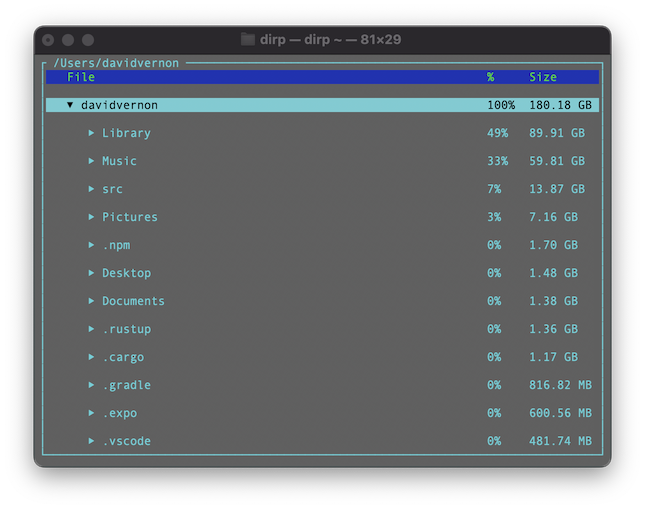

# dirp

A Directory Pruner. This tool is a terminal UI app, written in Rust, that helps you remove unwanted clutter from your file system. 

## Usage

```
$ dirp ~
```

This command will open dirp on your home directory and display something similar to this.



The user can use the keyboard for various things.

```
    Up Arrow, p          - Move selection up.
    Down Arrow, n        - Move selection down.
    
    Left Arrow           - Show directory contents.
    Right Arrow          - Hide directory contents.
    f                    - Toggle directory contents.
    
    d, Delete, Backspace - Toggle selection for removal.
    
    x                    - Remove marked files, and exit program.
    q                    - Exit program.
```

NOTE: Nothing is removed from the file system until the user hits the 'x' key. A list of all marked files is then presented and the user is prompted to remove them or just exit. 

NOTE: This tool doesn't delete anything. It moves all marked files into the system Trash directory.

## Install 
### Mac
Run the following from a terminal to install cpr in /usr/local/bin. 
```
/bin/bash -c "$(curl -fsSL https://raw.githubusercontent.com/DavidHVernon/dirp/master/install.sh)"
```
### Linux, WSL
Run the following from a terminal to install cpr in /usr/local/bin. (On some systems you might need to sudo this command.)
```
Coming soon...
```
### Windows
```
Coming soon...
```

## Build from Source

If you don't have rust installed: https://www.rust-lang.org/tools/install.
Then...
```
$ cargo build --release
$ ./install-dev.sh
```

## Author

[David Vernon](email:davidhvernon@mac.com)

## Version History

* 0.1.0
    * Initial release.

## License

This project is licensed under the MIT License - see the [license-mit.md](license-mit.md) file for details.

